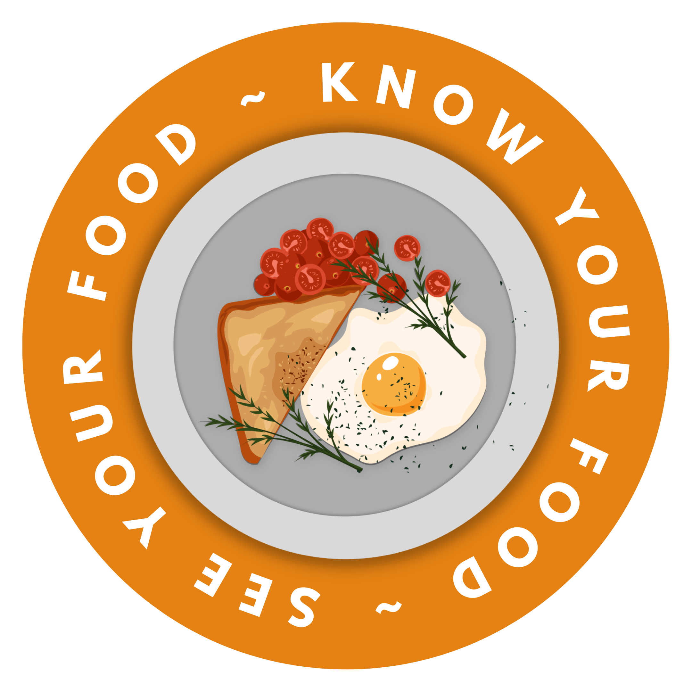
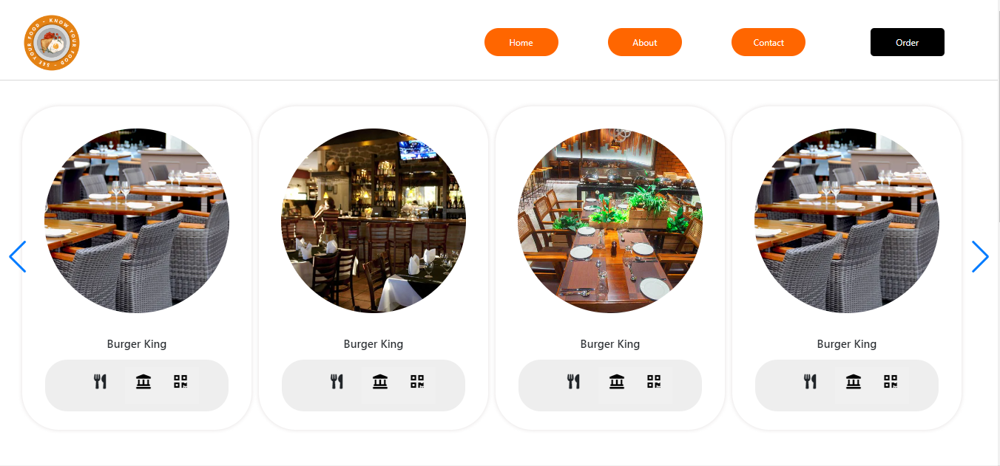
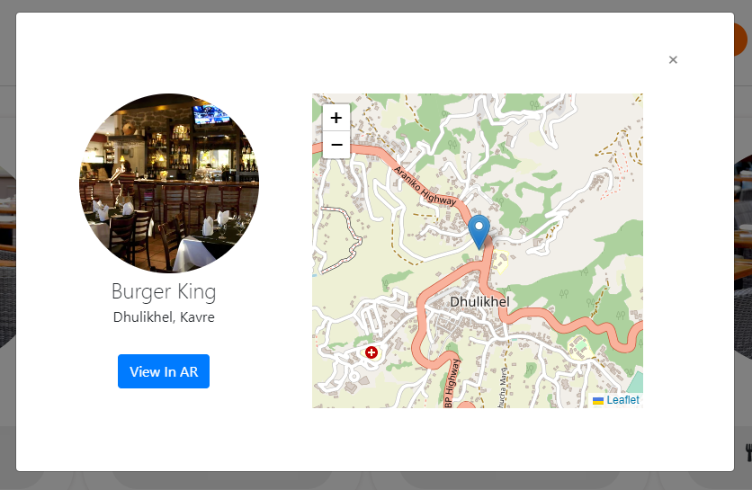
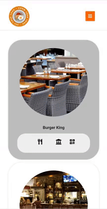

 

  

  <h3 align="center">ARestro</h3>

  

    Solving Classical Problem By Digitalizing Restaurant
     
    <a href="https://github.com/KUHackfest2022/Website/docs/"><strong>Explore the docs »</strong></a>
     
     
    <a href="https://ku-hackfest-website.herokuapp.com/">View Demo</a>
    ·
    <a href="https://github.com/KUHackfest2022/Website/issues">Report Bug</a>
    ·
    <a href="https://github.com/KUHackfest2022/Website/issues">Request Feature</a>
  

  
Table of Contents

  <ol>
    <li>
      <a href="#about-the-project">About The Project</a>
      <ul>
        <li><a href="#built-using">Built Using</a></li>
      </ul>
    </li>
    <li>
      <a href="#getting-started">Getting Started</a>
      <ul>
        <li><a href="#installation">Installation</a></li>
      </ul>
    </li>
    <li><a href="#usage">Usage</a></li>
    <li><a href="#contributing">Contributing</a></li>
    <li><a href="#contact">Contact</a></li>
    <li><a href="#acknowledgments">Acknowledgments</a></li>
  </ol>

### About the Project

This project strives towards the revolutionary upgrade from the traditional restaurant culture to fully digital restaurant culture. This website is one of the two essential component of turning restaurants and hotel in to a paperless serving system. In addition to providing people the opportunity to order online, we provide them 
the opportunity to see what they are going to be served bofore hand. Using the latest AR tech using Vuforia we will be able to see the near real life scale of the food.
The site will provide us with a custom QR code made using the logo of the organization which you will be able to scan using our Android/Ios App. Then we can sucessfully scroll through different models and see it live on a surface.

> Below is the screenshot of the desktop version of the website

> The functionality below allows us to find the location of the restaurant you are visiting

> The design is also responsive in your phone

(<a href="#readme-top">back to top</a>)

### Built Using 

The major frameworks used in the project are below, new frameworks/ library might be added according to our necessity.

* [![Bootstrap][Bootstrap.com]][Bootstrap-url]
* [![JQuery][JQuery.com]][JQuery-url]

(<a href="#readme-top">back to top</a>)

<!-- GETTING STARTED -->
## Getting Started

You can run this project locally in you laptop after installing Xampp software.

### Installation

Please strictly follow the instructions below for running this project.

1. Install xampp from (<a href="https://www.apachefriends.org/download.html">Xampp</a>)
2. Start the Apache Server
3. After you have successfully cloned the project you can see it in localhost

(<a href="#readme-top">back to top</a>)

<!-- USAGE EXAMPLES -->
## Usage

Use this space to show useful examples of how a project can be used. Additional screenshots, code examples and demos work well in this space. You may also link to more resources.

_For more examples, please refer to the [Documentation](https://example.com)_

(<a href="#readme-top">back to top</a>)

<!-- CONTRIBUTING -->
## Contributing

Contributions are what make the open source community such an amazing place to learn, inspire, and create. Any contributions you make are **greatly appreciated**.

If you have a suggestion that would make this better, please fork the repo and create a pull request. You can also simply open an issue with the tag "enhancement".
Don't forget to give the project a star! Thanks again!

1. Fork the Project
2. Create your Feature Branch (`git checkout -b feature/AmazingFeature`)
3. Commit your Changes (`git commit -m 'Add some AmazingFeature'`)
4. Push to the Branch (`git push origin feature/AmazingFeature`)
5. Open a Pull Request

(<a href="#readme-top">back to top</a>)

(<a href="#readme-top">back to top</a>)

<!-- CONTACT -->
## Contact

Siddhartha Ghimire - [@sid_ghimire](https://twitter.com/sid_ghimire) - siddharthaghimire@gmail.com

Project Link: [https://github.com/KUHackfest2022/Website](https://github.com/KUHackfest2022/Website)

(<a href="#readme-top">back to top</a>)

<!-- ACKNOWLEDGMENTS -->
## Acknowledgments

Use this space to list resources you find helpful and would like to give credit to. I've included a few of my favorites to kick things off!

* [Choose an Open Source License](https://choosealicense.com)
* [GitHub Emoji Cheat Sheet](https://www.webpagefx.com/tools/emoji-cheat-sheet)
* [Malven's Flexbox Cheatsheet](https://flexbox.malven.co/)
* [Malven's Grid Cheatsheet](https://grid.malven.co/)
* [Img Shields](https://shields.io)
* [GitHub Pages](https://pages.github.com)
* [Font Awesome](https://fontawesome.com)

(<a href="#readme-top">back to top</a>)

<!-- MARKDOWN LINKS & IMAGES -->
<!-- https://www.markdownguide.org/basic-syntax/#reference-style-links -->
[contributors-shield]: https://img.shields.io/github/contributors/othneildrew/Best-README-Template.svg?style=for-the-badge
[contributors-url]: https://github.com/KUHackfest2022/Website/graphs/contributors
[forks-shield]: https://img.shields.io/github/forks/othneildrew/Best-README-Template.svg?style=for-the-badge
[forks-url]: https://github.com/KUHackfest2022/Website/network/members
[stars-shield]: https://img.shields.io/github/stars/othneildrew/Best-README-Template.svg?style=for-the-badge
[stars-url]: https://github.com/KUHackfest2022/Website/stargazers
[issues-shield]: https://img.shields.io/github/issues/othneildrew/Best-README-Template.svg?style=for-the-badge
[issues-url]: https://github.com/KUHackfest2022/Website/issues
[license-shield]: https://img.shields.io/github/license/othneildrew/Best-README-Template.svg?style=for-the-badge
[linkedin-shield]: https://img.shields.io/badge/-LinkedIn-black.svg?style=for-the-badge&logo=linkedin&colorB=555
[linkedin-url]: https://linkedin.com/in/othneildrew
[product-screenshot]: images/screenshot.png

[Bootstrap.com]: https://img.shields.io/badge/Bootstrap-563D7C?style=for-the-badge&logo=bootstrap&logoColor=white
[Bootstrap-url]: https://getbootstrap.com
[JQuery.com]: https://img.shields.io/badge/jQuery-0769AD?style=for-the-badge&logo=jquery&logoColor=white
[JQuery-url]: https://jquery.com 

